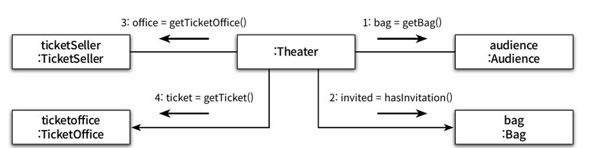
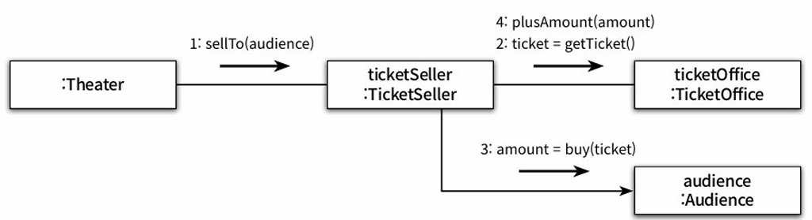

### 티켓 판매 애플리케이션 구현하기

- 작은 소극장을 운영
- 소극장 홍보겸 이벤트 기획
  - 추첨을 통해 선정된 관람객에게 공연을 무료로 관람할 수 있는 초대장 발송.
- 이벤트에 당첨된 관람객과 그렇지 못한 관람객 다른 방식으로 입장.
- 이벤트 당첨자는 티켓으로 교환라 초대장을 소유
- 이벤트에 당첨되지 않은 관람객은 티켓을 구매할 수 있는 현금을 보유
- 따라서 관람객이 가지고 올 수 있는 소지품은 초대장, 현금, 티켓 3가지  


- 관람객이 극장에 입장하기 위해서는 매표소에서 초대장을 티켓으로 교환하거나 구매
- 따라서 매표소에는 관람객에게 판매할 티켓과 티켓의 판매 금액이 보관돼 있어야 한다.

### 무엇이 문제인가
모든 소프트웨어 모듈에는 세가지 목적이 있다.
- 실행 중에 제대로 동작하는 것으로, 이것은 모듈의 존재 이유라고 할 수 있다.
- 목적은 변경을 위해 존재하는 것이다. 
  - 대부분의 모듈은 생명주기 동안 변경되기 때문에 간단한 작업만으로도 변경이 가능해야 한다.
  - 변경하기 어려운 모듈은 제대로 동작하더라도 개선해야 한다.
- 코드를 읽는 사람과 의사소통하는 것이다.
  - 모듈은 특별한 훈련 없이도 개발자가 쉽게 읽고 이해할 수 있어야 한다.
  - 읽는 사람과 의사소통할 수 없는 모듈은 개선해야 한다.

즉, **모든 모듈은 제대로 실행돼야 하고, 변경이 용이해야 하며, 이해하기 쉬워야 한다.**

### 예상을 빗나가는 코드
```
소극장은 관람객의 가방을 열어 그 안에 초대장이 들어 있는지 살펴본다. 
가방 안에 초대장이 들어 있으면 판매원은 매표소에 보관돼 있는 티켓을 관람객의 가방 안으로 옮긴다. 
가방 안에 초대장이 들어 있지 않다면 관람객의 가방에서 티켓 금액만큼의 현금을 꺼내 매표소에 적립한 
후에 매표소에 보관돼 있는 티켓을 관람객의 가방 안으로 옮긴다.
```  
- **문제는 관람객과 판매원이 소극장의 통제를 받는 수동적인 존재라는 점이다.**  
- 현재의 코드는 우리의 상식과는 너무나도 다르게 동작하기 때문에 코드를 읽는 사람과 제대로 의사소통하지 못한다.  
- 또한 코드를 이해하기 위해서는 여러 가지 세부적인 내용들을 한꺼번에 기억하고 있어야 한다.
- **가장 심각한 문제는 Audience와 TicketSeller를 변경할 경우 Theater도 함께 변경해야 한다는 사실이다.**

### 변경에 취약한 코드
- 변경에 취약하다.
  - 만약 관람객이 현금이 아니라 신용카드를 이용해서 결제를 한다면?
  - 판매원이 매표소 밖에서 티켓을 판매해야 한다면?
  - 관감객이 가방을 들고 있지 않다면?
  - **모든 코드가 일시에 흔들리게 된다.**
- 이것은 객체 사이의 **의존성 Dependency**과 관련된 문제다.
- 객체지향 설계는 **서로 의존하면서 협력하는 객체들의 공동체를 구축하는 것**이다.
- 따라서 **애플리케이션의 기능을 구현하는 데 필요한 최소한의 의존성만 유지하고 불필요한 의존성을 제거하는 것**이 목표이다.
- 객체 사이의 의존성이 과한 경우를 가리켜 `결합도가 높다` 라고 말한다.
- 객체들이 합리적인 수준으로 의존할 경우에는 `결합도가 낮다` 라고 말한다.
- 설계의 목표는 **객체 사이의 결합도를 낮춰 변경이 용이한 설계**를 만드는 것이어야 한다.

### 설계 개선하기
- Theater가 관람객의 가방과 판매원의 매표소에 직접 접근한다는 것은 Theater가 Audience와 TicketSeller에 결합된다는 것을 의미.
- 해결 방법은 간단하다.
  - Theater가 Audience와 TicketSeller에 관해 너무 세세한 부분까지 알지 못하도록 정보를 차단하면 된다.
  - 다시 말해서 관람객과 판매원을 **자율적인 존재**로 만들면 되는 것이다.


### 캡슐화
: 개념적이나 물리적으로 객체 내부의 세부적인 사항을 감추는 것.  
캡슐화의 목적은 변경하기 쉬운 객체를 만드는 것이다.  
캡슐화를 통해 객체 내부로의 접근을 제한하면 객체와 객체 사이의 결합도를 낮출 수 있기 때문에 설계를 좀 더 쉽게 변경할 수 있게 된다.

### 인터페이스와 구현
객체를 인터페이스와 구현으로 나누고 `인터페이스만을 공개`하는 것은 객체 사이의 `결합도를 낮추고 변경하기 쉬운 코드를 작성`하기 위해 따라야 하는 가장 기본적인 설계 원칙이다.

### 무엇이 개선됐는가
Audience 와 TicketSeller가 내부 구현을 외부에 노출하지 않고 자신의 문제를 스스로 책임지고 해결한다는 것이다.  
다시 말해 자율적인 존재가 된 것이다.  
중요한 점은 `Audience나 TicketSeller의 내부 구현을 변경하더라도 Theater를 함께 변경할 필요가 없어졌다`는 것이다.  

### 어떻게 한 것인가
- 판매자가 티켓을 판매하기 위해 TicketOffice를 사용하는 모든 부분을 TicketSeller 내부로 옮기고
- 관람객이 티켓을 구매하기 위해 Bag을 사용하는 모든 부분을 Audience 내부로 옮긴 것이다.
- 다시 말해 자기 자신의 문제를 스스로 해결하도록 코드를 변경한 것이다.

### 캡슐화와 응집도
- 핵심은 `객체 내부의 상태를 캡슐화`하고 `객체 간에 오직 메시지를 통해서만 상호작용`하도록 만드는 것이다.
- **밀접하게 연관된 작업만을 수행하고 연관성 없는 작업은 다른 객체에게 위임**하는 객체를 가리켜 `응집도(cohesion)가 높다` 라고 말한다.
- 객체는 `자신의 데이터를 스스로 처리하는 자율적인 존재`여야 한다.
  - 이것이 객체의 응집도를 높이는 첫 걸음이다.

### 절차지향과 객체지향
- Theater의 enter 메서드는 `프로세스(Process)`, Audience, TIcketSeller, Bag, TicketOffice는 `데이터(Data)`
- `프로세스와 데이터를 별도의 모듈에 위치시키는 방식을 절차적 프로그래밍(Procedural Programming)` 이라고 부른다.
- 절차적 프로그래밍의 세상에는 `데이터의 변경으로 인한 영향을 지역적으로 고립시키기 어렵다.`
  - 따라서 절차적 프로그래밍의 `세상은 변경하기 어려운 코드를 양산하는 경향`이 있다.


- `자신의 데이터를 스스로 처리하도록` 프로세스의 적절한 단계를 Audience와 TicketSeller로 이동시키는 것.
  - `데이터와 프로세스가 동일한 모듈 내부에 위치하도록 프로그래밍 하는 방식을 객체지향 프로그래밍(Object-Oriented Programming)` 이라고 부른다.
- 훌륭한 객체지향 설계의 핵심은 `캡슐화를 이용해 의존성을 적절히 관리함으로써 객체 사이의 결합도를 낮추는 것`이다.

### 책임의 이동
- 책임이 중앙집중된 절차적 프로그래밍
  
- 책임이 분산된 객체지향 프로그래밍
  
- Theater에 몰려 있던 책임이 개별 객체로 이동 -> `책임의 이동`
- TicketSeller의 책임은 무엇인가? 
  - 티켓을 판매하는 것이다!
- Audience의 책임은 무엇인가? 
  - 티켓을 사는 것이다!
- Theater의 책임은 무엇인가? 
  - 관람객을 입장시키는 것이다!


- **설계를 어렵게 만드는 것은 의존성**
- 해결방법은 **불필요한 의존성을 제거하여 객체 사이의 결합도를 낮추는 것**


### 객체지향 설계
- 우리가 진정으로 원하는 것은 변경에 유연하게 대응할 수 있는 코드다.
- 변경 가능한 코드란 이해하기 쉬운 코드다.
- 훌륭한 객체지향 설계란 협력하는 객체 사이의 의존성을 적절하게 관리하는 설계다.
- `객체 간의 의존성은 애플리케이션을 수정하기 어렵게 만드는 주범`이다.
- 