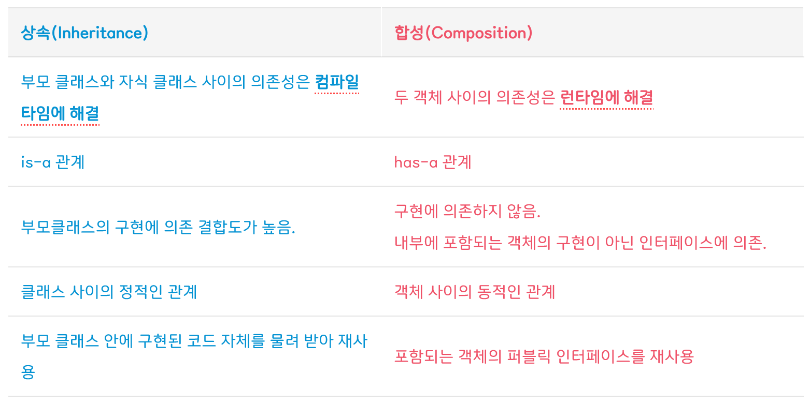

### 협력, 객체, 클래스

진정한 객체지향 패러다임으로의 전환은 클래스가 아닌 `객체에 초점`을 맞출 떄에만 얻을 수 있다.

- 어떤 클래스가 필요한지 고민하기 전에 `어떤 객체들이 필요한지 고민`하라
- 객체를 독립적인 존재가 아니라 `기능을 구현하기 위해 협력하는 공동체의 일원`으로 봐야 한다.

### 도메인의 구조를 따르는 프로그램 구조

소프트웨어는 사용자가 원하는 어떤 문제를 해결하기 위해 만들어 진다.  
문제를 해결하기 위해 사용자가 프로그램을 사용하는 분야를 `도메인`이라고 부른다.

요구사항과 프로그램을 객체라는 동일한 관점에서 바라볼 수 있기 때문에 도메인을 구성하는 개념들이 프로그램의 객체와 클래스로 매끄럽게 연결될 수 있다.

일반적으로 클래스의 이름은 대응되는 도메인 개념의 이름과 동일하거나 적어도 유사하게 지어야 한다.  
클래스 사이의 관계도 최대한 도메인 개념 사이에 맺어진 관계와 유사하게 만들어 프로그램의 구조를 이해하고 예상하기 쉽게 만들어야 한다.

### 클래스 구현

인스턴스 변수의 가시성은 private 이고 메서드의 가시성은 public  
클래스를 구현하거나 다른 개발자에 의해 개발된 클래스를 사용할 때 가장 중요한 것은 `클래스의 경계를 구분 짓는 것`이다.
훌륭한 클래스를 설계하기 위한 핵심은 어떤 부분을 외부에 공개하고 어떤 부분을 감출지를 결정하는 것이다.

#### 클래스의 내부와 외부를 구분해야 하는 이유

`경계의 명확성이 객체의 자율성을 보장`하기 때문이다.
더 중요한 이유로 `프로그래머에게 구현의 자유를 제공`하기 때문이다.

#### 자율적인 객체

- 객체는 `상태(state)` 와 `행동(behavior)` 을 함께 가지는 복합적인 존재
- 객체는 스스로 판단하고 행동하는 `자율적인` 존재

객체지향은 객체라는 단위 안에 데이터와 기능을 한 덩어리로 묶음으로써 문제 영역의 아이디어를 적절하게 표현할 수 있게 했다.  
이처럼 데이터와 기능을 객체 내부로 함께 묶는 것을 `캡슐화` 라고 부른다.

객체지향 프로그래밍 언어들은 상태와 행동을 캡슐화 하는 것에서 한 걸음 더 나아가 외부에서의 접근을 통제할 수 있는 `접근 제어(access control)` 메커니즘도 함꼐 제공한다.  
이를 위해 public, protected, private 과 같은 `접근 수정자(access modifier)` 를 제공한다.

객체 내부에 대한 `접근을 통제하는 이유는 객체를 자율적인 존재로 만들기 위해서`다.  
객체가 자율적인 존재로 서기 위해서는 외부의 간섭을 최소화해야 한다.  
`외부에서는 객체에게 원하는 것을 요청하고는 객체가 스스로 최선의 방법을 결정할 수 있을 것이라는 점을 믿고 기다려야 한다.`

캡슐화와 접근 제어는 객체를 두 부분으로 나눈다.  
**(인터페이스와 구현의 분리)**

- 외부에서 접근 가능한 부분 : `퍼블릭 인터페이스(public interface)`
- 외부에서 접근 불가능하고 오직 내부에서만 접근 가능한 부분 : `구현(implementation)`

#### 프로그래머의 자유

프로그래머의 역할을 `클래스 작성자(class creator)` 와 `클라이언트 프로그래머(client programmer)`로 구분하는 것이 유용하다.

- 클래스 작성자 : 새로운 타입을 프로그램에 추가
- 클라이언트 프로그래머 : 클래스 작성자가 추가한 데이터 타입을 사용

### 협력하는 객체들의 공동체

- 시스템의 어떤 **기능을 구현하기 위해 객체들 사이에 이뤄지는 상호작용**을 `협력(Collaboration)`이라고 부른다
- 객체지향 프로그램을 작성할 때는 `먼저 협력의 관점에서 어떤 객체가 필요한지를 결정`하고, `객체들의 공통 상태와 행위를 구현하기 위해 클래스를 작성`한다.

### TEMPLATE METHOD

`부모 클래스에 기본적인 알고리즘의 흐름을 구현하고 중간에 필요한 처리를 자식 클래스에게 위임하는 디자인 패턴`을 TEMPLATE METHOD 패턴 이라고 부른다.

### 컴파일 시간 의존성과 실행 시간 의존성

코드의 의존성과 실행 시점의 의존성이 서로 다를 수 있다는 것이다.  
다시 말해 클래스 사이의 의존성과 객체 사이의 의존성은 동일하지 않을 수 있다.  
그리고 유연하고, 쉽게 재사용할 수 있으며, 확장 가능한 객체지향 설계가 가지는 특징은 코드의 의존성과 실행 시점의 의존성이 다르다는 것이다.

하지만, 코드의 의존성과 실행 시점의 의존성이 다르면 다를수록 코드를 이해하기 어려워진다는 것이다.

설계가 유연해질수록 코드를 이해하고 디버깅하기는 점점 더 어려워진다!  
하지만 유연성을 억제하면 코드를 이해하고 디버깅하기는 쉬워지지만 재사용과 확장 가능성은 낮아진다!  
따라서 `항상 유연성과 가독성 사이에서 고민`해야 한다.  
`무조건 유연한 설계도, 무조건 읽기 쉬운 코드도 정답이 아니다!`

### 차이에 의한 프로그래밍

**부모 클래스와 다른 부분만을 추가해서 새로운 클래스를 쉽고 빠르게 만드는 방법**을 `차이에 의한 프로그래밍(programming by difference)` 이라고 부른다.

### 상속과 인터페이스

인터페이스는 객체가 이해할 수 있는 메시지의 목록을 정의한다는 것을 기억하라.  
상속을 통해 자식 클래스는 자신의 인터페이스에 부모 클래스의 인터페이스를 포함하게 된다.  
결과적으로 외부 객체는 자식 클래스를 부모 클래스와 동일한 타입으로 간주할 수 있다.

자식 클래스는 상속을 통해 부모 클래스의 인터페이스를 물려받기 때문에 부모 클래스 대신 사용될 수 있다.  
컴파일러는 코드 상에서 부모 클래스가 나오는 모든 장소에서 자식 클래스를 사용하는 것을 허락한다.  
이처럼 자식 클래스가 부모 클래스를 대신하는 것을 `업캐스팅(upcasting)`이라고 부른다.

### 다형성

**메시지와 메서드는 다른 개념이다!!!**

- Movie는 DiscountPolicy의 인스턴스에게 calculateDiscountAmount 메시지를 전송한다.
- 실행되는 메서드는 Movie와 상호작용하기 위해 연결된 객체의 클래스가 무엇인가에 따라 달라진다.
- Movie와 협력하는 객체가 AmoundDiscountPolicy의 인스턴스라면 AmountDiscountPolicy에서 오버라이딩한 메서드가 실행되고
- Movie와 협력하는 객체가 PercentDiscountPolicy의 인스턴스라면 PercentDiscountPolicy에서 오버라이딩한 메서드가 실행될 것이다.

이처럼 **동일한 메시지를 전송하지만** 실제로 **어떤 메서드가 실행될 것인지는 메시지를 수신하는 객체의 클래스가 무엇이냐에 따라 달라**지고  
이를 `다형성` 이라고 부른다.  
다시말해 **동일한 메시지를 수신했을 때 객체의 타입에 따라 다르게 응답할 수 있는 능력을 의미**한다.

#### 지연 바인딩(lazy binding) or 동적 바인딩(dynamic binding)

- 메시지에 응답하기 위해 실행될 메서드를 **컴파일 시점이 아닌 실행 시점에 결정**

#### 초기 바인딩(eager binding) or 정적 바인딩(static binding)

- 전통적인 함수 호출처럼 **컴파일 시점에 실행될 함수나 프로시저를 결정**

객체지향이 **컴파일 시점의 의존성과 실행 시점의 의존성을 분리**하고, 하나의 **메시지를 선택적으로 서로 다른 메서드에 연결할 수 있는 이유**가 바로 `지연 바인딩`이라는 메커니즘을 사용하기 때문이다.

### 추상화와 유연성

- 추상화를 사용하면 세부적인 내용을 무시한 채 상위 정책을 쉽고 간단하게 표현할 수 있다.
    - 세부사항에 억눌리지 않고 **상위 개념만으로도 도메인의 중요한 개념을 설명**할 수 있게 한다.
- 재사용 가능한 설계의 기본을 이루는 `디자인 패턴(design pattern)` 이나 `프레임워크(framework)` 모두 **추상화를 이용해 상위 정책을 정의하는 객체지향의 메커니즘을 활용**하고 있다.
- 추상화를 이용해 상위 정책을 표현하면 **기존 구조를 수정하지 않고도 새로운 기능을 쉽게 추가하고 확장**할 수 있다.
    - = 설계를 유연하게 만들 수 있다.

- 구현과 관련된 모든 것들이 트레이드오프의 대상이 될 수 있다!!
- 작성하는 모든 코드에는 합당한 이유가 있어야 한다!!
- 사소한 결정이라도 트레이드오프를 통해 얻어진 결론과 그렇지 않은 결론 사이의 차이는 크다!!
- 고민하고 트레이드오프하라!!

### 상속

상속은 객체지향에서 코드를 재사용하기 위해 널리 사용되는 기법이다.

하지만 두 가지 관점에서 설계에 안 좋은 영향을 미친다.

- 상속이 캡슐화를 위반한다는 것
- 설계를 유연하지 못하게 만든다는 것
  - 인스턴스 변수로 연결한 기존 방법을 사용하면 실행 시점에 할인 정책을 간단하게 변경할 수 있다.

결과적으로 부모 클래스의 구현이 자식 클래스에게 노출되기 때문에 캡슐화가 약화된다.

캡슐화의 약화는 자식 클래스가 부모 클래스에 강하게 결합되도록 만들기 때문에 부모 클래스를 변경할 때 자식 클래스도 함께 변경될 확률을 높인다.

**결과적으로 상속을 과도하게 사용한 코드는 변경하기도 어려워진다.**

### 합성

Movie는 DiscountPolicy가 외부에 calculateDiscountAmount 메서드를 제공한다는 사실만 알고 내부 구현에 대해서는 전혀 알지 못한다.

이처럼 **인터페이스에 정의된 메시지를 통해서만 코드를 재사용하는 방법**을 `합성` 이라고 부른다.

합성은 상속이 가지는 두가지 문제점을 모두 해결한다.

- 인터페이스에 정의된 메시지를 통해서만 재사용이 가능하기 때문에 구현을 효과적으로 캡슐화할 수 있다.
- 의존하는 인스턴스를 교체하는 것이 비교적 쉽기 때문에 설계를 유연하게 만든다.

따라서 코드 재사용을 위해서는 상속보다는 합성을 선호하는 것이 더 좋은 방법이다!!

출처: Inpa Dev

* 그렇다고 해서 상속을 절대 사용하지 말라는 것은 아니다..!
* 객체지향에서 가장 중요한 것은 애플리케이션의 기능을 구현하기 위해 `협력에 참여하는 객체들 사이의 상호작용`이다.
* 