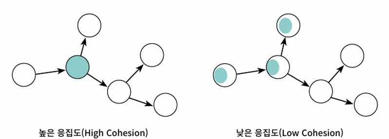
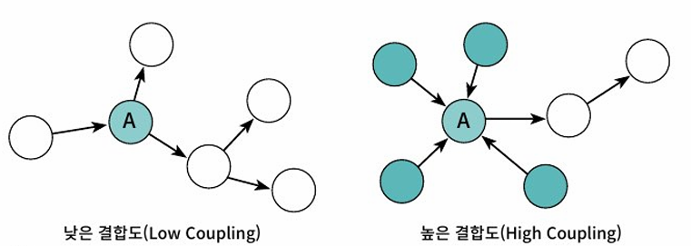

# CH04 : 설계 품질과 트레이드 오프

## 01: 데이터 중심의 영화 예매 시스템

객체지향 설계에서는 두 가지 방법을 이용해 시스템을 개체로 분할할 수 있다.

1. 상태를 분할의 중심축으로 삼는 방법

2. 책임을 분할의 중심축으로 삼는 방법

일반적으로 `객체의 상태는 객체가 저장해야 하는 데이터의 집합을 의미` 하기 때문에 `상태`와 `데이터`를 동일한 의미로 사용하겠다.

데이터 중심의 관점은 객체의 상태에 초점을 맞추고, 책임 중심의 관점은 객체의 행동에 초점을 맞춘다.

전자는 객체를 독립된 데이터 덩어리로 바라보고 후자는 객체를 협력하는 공동체의 일원으로 바라본다.

> 결론부터 말하자면 훌륭한 객체지향 설계는 데이터가 아니라 책임에 초점을 맞춰야 한다. 이유는 변경과 관련이 있다.

`객체의 상태는 구현에 속하고, 구현은 불안정`하기 때문에 변하기 쉽다.

결과적으로 상태 변경은 인터페이스의 변경을 초래하며 인터페이스에 의존하는 모든 객체에게 변경의 영향이 퍼지게 된다.

따라서 `데이터에 초점을 맞추는 설계는 변경에 취약`할 수 밖에 없다.

`반면 책임은 인터페이스에 속한다.`

객체는 책임을 드러내는 `안정적인 인터페이스 뒤로` 책임을 수행하는 데 필요한 `상태를 캡슐화`함으로써 구현 변경에 대한 파장이 외부로 퍼져나가는 것을 방지한다.

따라서 `책임에 초점을 맞추면 상대적으로 변경에 안정적인 설계`를 얻을 수 있게 된다.

### 데이터를 준비하자

데이터 중심의 설계에서는 `객체가 포함해야 하는 데이터에 집중`한다.

특히, 객체의 종류를 저장하는 인스턴스 변수(movieType)와 인스턴스의 종류에 따라 배타적으로 사용될 인스턴스 변수(discountAmount, discountPercent)를 하나의 클래스 안에 함께
포함시키는 방식은 데이터 중심의 설계 안에서 흔히 볼 수 있는 패턴이다.

내부 데이터가 객체의 엷은 막을 빠져나가 외부의 다른 객체들을 오염시키는 것을 막아야 한다.

이를 달성할 수 있는 가장 간단한 방법은 내부의 데이터를 반환하는 `접근자(accessor)`와 데이터를 변경하는 `수정자(mutator)`를 추가하는 것이다.

## 02: 설계 트레이드 오프

### 캡슐화

상태와 행동을 하나의 객체 안에 모으는 이유는 `객체의 내부 구현을 외부로부터 감추기 위해`서다.

구현이란 나중에 변경될 가능성이 높은 어떤 것을 가리킨다.

`객체지향이 강력한 이유`는 한 곳에서 일어난 변경이 전체 시스템에 영향을 끼치지 않도록 `파급효과를 적절하게 조절할 수 있는 장치를 제공`하기 때문이다.

**변경될 가능성이 높은 부분**을 `구현`이라고 부르고 **상대적으로 안정적인 부분**을 `인터페이스`라고 부른다.

객체를 설계하기 위한 가장 기본적인 아이디어는

> 변경의 정도에 따라 **구현과 인터페이스를 분리**하고 **외부에서는 인터페이스에만 의존하도록 관계를 조절하는 것**이다.

정리하면,

> 캡슐화란 변경 가능성이 높은 부분을 객체 내부로 숨기는 추상화 기법이다.
>
> 객체 내부에 무엇을 캡슐화 해야 하는가?
>
> **변경될 수 있는 어떤 것이라도 캡슐화** 해야 한다.
>
> 이것이 바로 객체지향 설계의 핵심이다.

> 유지 보수성이 목표다.
>
> 여기서 유지보수성이란 **두려움 없이, 주저함 없이, 저항감 없이 코드를 변경할 수 있는 능력**을 말한다.
>
> 가장 중요한 동료는 캡슐화다.
>
> 캡슐화란 **어떤 것을 숨긴다는 것을 의미**한다.
>
> 시스템의 한 부분을 다른 부분으로부터 감춤으로써 **뜻밖의 피해가 발생할 수 있는 가능성을 사전에 방지**할 수 있다.

### 응집도와 결합도

응집도와 결합도는 구조적 설계 방법이 주도하던 시대에 소프트웨어의 품질을 측정하기 위해 소개된 기준이지만, 객체지향의 시대에서도 여전히 유효하다.

`응집도`는 **모듈에 포함된 내부 요소들이 연관돼 있는 정도**를 나타낸다.

모듈 내의 요소들이 **하나의 목적**을 위해 긴밀하게 협력한다면 그 모듈은 **높은 응집도**를 가진다.

모듈 내의 요소들으 **서로 다른 목적**을 추구한다면 그 모듈은 **낮은 응집도**를 가진다.

`결합도`는 의존성의 정도를 나타내며 **다른 모듈에 대해 얼마나 많은 지식을 갖고 있는지를 나타내는 척도**다.

어떤 모듈이 다른 모듈에 대해 **너무 자세한 부분까지 알고 있다면** 두 모듈은 **높은 결합도**를 가진다.

어떤 모듈이 다른 모듈에 대해 **꼭 필요한 지식만 알고 있다면** 두 모듈은 **낮은 결합도**를 가진다.

**일반적으로 좋은 설계란** `높은 응집도`와 `낮은 결합도`를 가진 모듈로 구성된 설계를 의미한다.

**변경의 관점에서 응집도**란 `변경이 발생할 때 모듈 내부에서 발생하는 변경의 정도`로 측정할 수 있다.

응집도가 높을수록 **변경의 대상과 범위가 명확해지기 때문**에 코드를 변경하기 쉬워진다.

**변경의 관점에서 결합도**란 `한 모듈이 변경되기 위해서 다른 모듈의 변경을 요구하는 정도`로 측정할 수 있다.

> 다시 한번 강조
>
> **응집도와 결합도는 변경과 관련이 깊다.**
>
> 어떤 설계를 쉽게 변경할 수 있다면 높은 응집도를 가진 요소들로 구성돼 있고, 요소들 사이의 결합도가 낮을 확률이 크다.
>
> 만약 코드가 변경에 강하게 저항하고 있다면 낮은 응집도를 가진 요소들로 구성돼 있고, 요소들이 강하게 결합돼 있을 확률이 크다.
>
> **캡슐화의 정도가 응집도와 결합도에 영향을 미친다**는 사실을 강조하고 싶다.
>
> **캡슐화를 지키면 모듈 안의 응집도는 높아지고 모듈 사이의 결합도는 낮아진다.**
>
> **캡슐화를 위반하면 모듈 안의 응집도는 낮아지고 모듈 사이의 결합도는 높아진다.**

## 03: 데이터 중심의 영화 예매 시스템의 문제점

데이터 중심의 설계가 가진 대표적인 문제점을 다음과 같이 요약할 수 있다.

- 캡슐화 위반
- 높은 결합도
- 낮은 응집도

### 캡슐화 위반

getFee 메서드와 setFee 메서드는 Movie 내부에 Money 타입의 fee 라는 이름의 인스턴스 변수가 존재한다는 사실을 퍼블릭 인터페이스에 노골적으로 드러낸다.

Movie가 캡슐화의 원칙을 어기게 된 근본적인 원인은 객체가 수행할 책임이 아니라 **내부에 저장할 데이터에 초점을 맞췄기 때문**이다.

**객체에게 중요한 것은 책임**이고, 구현을 캡슐화할 수 있는 적절한 책임은 **협력이라는 문맥을 고려할 때만 얻을 수 있다.**

설계시 **협력에 관해 고민하지 않으면 캡슐화를 위반하는 과도한 접근자와 수정자를 가지게 되는 경향**이 있다.

객체가 사용될 문맥을 추측할 수 밖에 없는 경우 개발자는 최대한 많은 접근자 메서드를 추가하게 되는 것이다.

### 높은 결합도

ReservationAgency는 한 명의 예매 요금을 계산하기 위해 Movie의 getFee 메서드를 호출하며 계산된 결과를 Money 타입의 fee 에 저장한다.

이때 **fee의 타입을 변경한다고 가정**해보자.

이를 위해 **getFee 메서드의 반환 타입도 함께 수정**해야 할 것이다. 그리고 getFee 메서드를 호출하는 **ReservationAgency의 구현도** 변경된 타입에 맞게 **함께 수정**해야 할 것이다.

> 사실 getFee 메서드를 사용하는 것은 인스턴스 변수 fee의 가시성을 private에서 public 으로 변경하는 것과 거의 동일하다.

영화 예매 시스템을 살펴보면 대부분의 제어 로직을 가지고 있는 제어 객체인 **ReservationAgency가 모든 데이터 객체에 의존**한다는 것을 알 수 있다.

이는 **시스템 안의 어떤 변경도 ReservationAgency의 변경을 유발**한다.

> 데이터 중심의 설계는 전체 시스템을 하나의 거대한 의존성 덩어리로 만들어 버리기 때문에 어떤 변경이라도 일단 발생하고 나면 시스템 전체가 요동칠 수밖에 없다.

### 낮은 응집도

현재의 설계는 **새로운 할인 정책을 추가**하거나 **새로운 할인 조건을 추가**하기 위해 `하나 이상의 클래스를 동시에 수정`해야 한다.

**어떤 요구사항 변경을 수용하기 위해 하나 이상의 클래스를 수정해야 하는 것**은 `설계의 응집도가 낮다는 증거`이다.

> **단일 책임 원칙(Single Responsibility Principle, SRP)**
> 
> 클래스는 **단 한 가지의 변경 이유만** 가져야 한다.
> 
> 단일 책임 원칙에서의 책임은 지금까지 살펴본 역할, 책임, 협력에서 이야기하는 책임과는 다르며 변경과 관련된 더 큰 개념을 가리킨다.

## 04: 자율적인 객체를 향해

### 캡슐화를 지켜라

객체는 **자신이 어떤 데이터를 가지고 있는지를 내부에 캡슐화하고 외부에 공개해서는 안된다.**

객체는 스스로의 상태를 책임져야 하며 외부에서는 인터페이스에 정의된 메서드를 통해서만 상태에 접근할 수 있어야 한다.

여기서 말하는 메서드는 단순히 속성 하나의 값을 반환하거나 변경하는 접근자나 수정자를 의미하는 것이 아니다.

객체에게 의미 있는 메서드는 **객체가 책임져야 하는 무언가를 수행하는 메서드**다.

속성의 가시성을 **private으로 설정했다 해도 접근자와 수정자를 통해 속성을 외부로 제공하고 있다면** `캡슐화를 위반`하는 것이다.

### 스스로 자신의 데이터를 책임지는 객체

객체는 단순한 데이터 제공자가 아니다.

객체 내부에 저장되는 데이터보다 **객체가 협력에 참여하면서 수행할 책임을 정의하는 오퍼레이션이 더 중요**하다.

따라서 객체를 설계할 때 `이 객체가 어떤 데이터를 포함해야 하는가?` 라는 질문은 다음과 같은 두 개의 개별적인 질문으로 분리해야 한다.

- 이 객체가 어떤 데이터를 포함해야 하는가?
- 이 객체가 데이터에 대해 수행해야 하는 오퍼레이션은 무엇인가?

## 05: selfresponsibility 여전히 부족하다

분명히 캡슐화 관점에서 selfresponsibility 설계가 향상된 것이 맞지만, 그렇다고 해서 만족스러울 정도는 아니다.

### 캡슐화 위반

분명히 수정된 객체들은 자신의 데이터를 스스로 처리한다
    
    예를 들어 DiscountCondition은 자기 자신의 데이터를 이용해 할인 가능 여부를 스스로 판단한다.

하지만 DiscountCondition에 구현된 두 개의 isDiscountable 메서드를 자세히 살펴보면 이상한 점이 몇 군데 눈에 띈다.

기간 조건을 판단하는 `isDiscountable(DayOfWeek dayOfweek, LocalTime time)` 메서드의 시그니처를 자세히 살펴보면 DiscountCondition에 속성으로 포함돼 있는 DayOfWeek 타입의 요일 정보와 LocalTime 타입의 시간 정보를 파라미터로 받는 것을 알 수 있다.

이 메서드는 객체 내부에 DayOfWeek 타입의 요일과 LocalTime 타입의 시간 정보가 인스턴스 변수로 포함돼 있다는 사실을 인터페이스를 통해 외부에 노출하고 있는 것이다.

두 번째 `isDiscountable(int sequence)`메서드 역시 객체가 int 타입의 순번 정보를 포함하고 있음을 외부에 노출한다.

비록 setType 메서드는 없지만 getType 메서드를 통해 내부에 DiscountConditionType을 포함하고 있다는 정보 역시 노출시키고 있다.

만약 DiscountCondition의 속성을 변경한다면, 아마 두 isDiscountable 메서드의 파라미터를 수정하고 해당 메서드를 사용하는 모든 클라이언트도 함께 수정해야 할 것이다.

내부 구현의 변경이 외부로 퍼져나가는 `파급 효과(ripple effect)`는 **캡슐화가 부족하다는 명백한 증거**이다.

Movie 는 객체의 파라미터나 반환 값으로 내부에 포함된 속성에 대한 어떤 정보도 노출하지 않는다.

하지만! calculateAmountDiscountedFee(), calculatePercentDiscountedFee(), calculateNoneDiscountedFee() 라는 세 개의 메서드는 할인 정책에는 3가지가 존재한다는 사실을 만천하에 드러내고 있다.

> **캡슐화의 진정한 의미**
> 
> 이 예제는 캡슐화가 단순히 객체 내부의 데이터를 외부로부터 감추는 것 이상의 의미를 가진다는 것을 잘 보여준다.
> 
> 사실 캡슐화는 **변경될 수 있는 어떤 것이라도 감추는 것을 의미**한다.
> 
> 내부 속성을 외부로부터 감추는 것은 '데이터 캡슐화'라고 불리는 캡슐화의 한 종류일 뿐이다.
> 
> 종류 상관 없이 **내부 구현의 변경으로 인해 외부의 객체가 영향을 받는다면 캡슐화를 위반한 것**이다.

### 높은 결합도

캡슐화 위반으로 인해 DiscountCondition의 내부 구현이 외부로 노출됐기 때문에 Movie 와 DiscountCondition 사이의 결합도는 높을 수 밖에 없다.

두 객체 사이의 결합도가 높을 경우 한 객체의 구현을 변경할 때 다른 객체에게 변경의 영향이 전파될 확률이 높아진다는 사실을 기억하라.

- DiscountCondition의 기간 할인 조건의 명칭이 PERIOD에서 다른 값으로 변경된다면 Movie를 수정해야 한다.
- DiscountCondition의 종류가 추가되거나 삭제된다면 Movie 안의 if~else 구문을 수정해야 한다.
- 각 DiscountCondition의 만족 여부를 판단하는 데 필요한 정보가 변경된다면 Movie의 isDiscountable 메서드로 전달된 파라미터를 변경해야 한다.
  - 이로 인해 Movie의 isDiscountable 메서드는 시그니처도 함께 변경될 것이고 결과적으로 이 메서드에 의존하는 Screening에 대한 변경을 초래할 것이다.

모든 문제의 원인은 캡슐화 원칙을 지키지 않았기 때문이다.

DiscountCondition의 내부 구현을 제대로 캡슐화하지 못했기 때문에 DiscountCondition에 의존하는 Movie와의 결합도도 함께 높아진 것이다.

다시 한번 강조하지만, 유연한 설계를 창조하기 위해서는 캡슐화를 첫 번째 목표로 삼아야 한다.

### 낮은 응집도

Screening을 살펴보자.

DiscountCondition이 할인 여부를 판단하는데 필요한 정보가 변경된다면 Movie의 isDiscountable 메서드로 전달해야 하는 파라미터의 종류를 변경해야 하고,

이로 인해 Screening에서 Movie의 isDiscountable 메서드를 호출하는 부분도 함께 변경해야 한다.

결과적으로 할인 조건의 종류를 변경하기 위해서는 DiscountCondition, Movie 그리고 Movie를 사용하는 Screening을 함께 수정해야 한다.

**하나의 변경을 수용하기 위해 코드의 여러 곳을 동시에 변경해야 한다는 것**은 설계의 **응집도가 낮아는 증거**다.

응집도가 낮은 이유는 캡슐화를 위반했기 때문이다. 

DiscountCondition과 Movie의 내부 구현이 인터페이스에 그대로 노출되고 있고, Screening은 노출된 구현에 직접적으로 의존하고 있다.

이것은 원래 DiscountCondition이나 Movie에 위치해야하는 로직이 Screening으로 새어나왔기 때문이다.

## 06: 데이터 중심 설계의 문제점